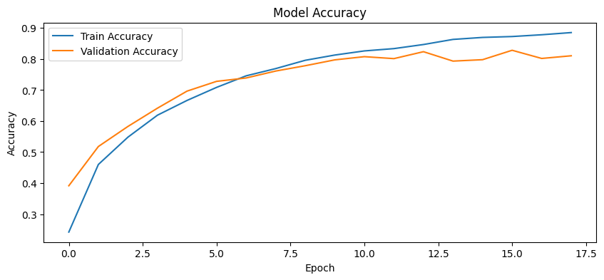
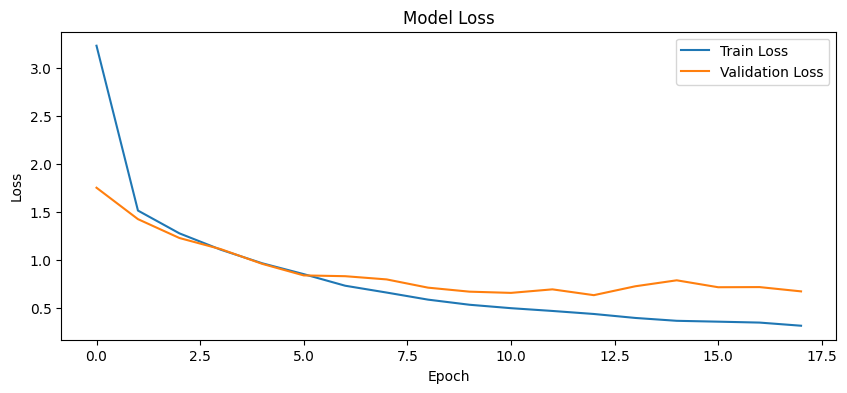

# 🌍 Environmental Sound Classification with CNNs | UrbanSound8K

This project implements a Convolutional Neural Network (CNN) to classify environmental sounds using the [UrbanSound8K](https://urbansounddataset.weebly.com/urbansound8k.html) dataset. Sounds such as dog barks, sirens, and drilling are converted into Mel-frequency cepstral coefficients (MFCCs) and used to train a deep learning model for multi-class audio classification.

## 🎯 Objective

To build an audio classification pipeline that:
- Preprocesses raw WAV files into fixed-length MFCC feature vectors.
- Encodes sound class labels using one-hot encoding.
- Trains a CNN on the extracted features.
- Evaluates and visualizes training/validation performance.
- Tests final accuracy on unseen audio samples.

## 🧰 Technologies Used
- Python
- TensorFlow/Keras
- Librosa
- Pandas & NumPy
- Matplotlib & TQDM

## 📦 Dataset
- [UrbanSound8K](https://urbansounddataset.weebly.com/urbansound8k.html): 8,732 labeled sound excerpts (<= 4s) of urban sounds from 10 classes.

## 📊 Model Architecture
- 2 Convolutional + MaxPooling layers
- Dropout for regularization
- Dense layers with ReLU and softmax activation
- Early stopping to prevent overfitting

## 🚀 Results
- Achieved over **80%** test accuracy (insert actual result here)
- Clear learning curves for training vs. validation

## 📈 Training Visualizations

